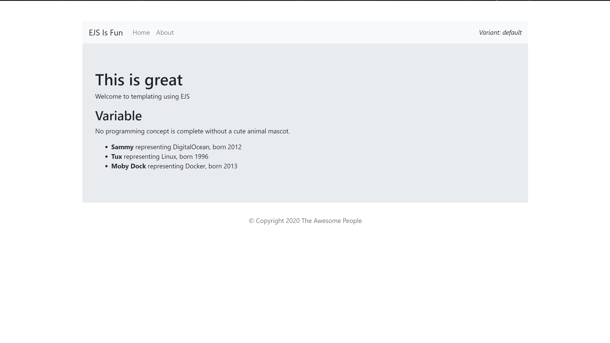
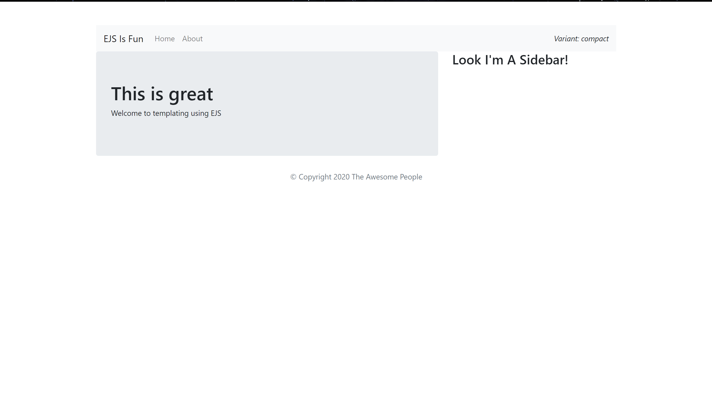

# EJS-Demo

Developed a simple Express application using the EJS view engine. The program consists of a [server.js](https://github.com/muntasir-hossain314159/EJS-digitalocean-tutorial-ahoss1/blob/main/server.js) file which is responsible for:
1. setting the view engine to EJS
2. creating a server and listening to port 8080
3. processing get requests and displaying the [Home](https://github.com/muntasir-hossain314159/EJS-digitalocean-tutorial-ahoss1/blob/main/images/Home.PNG) and [About](https://github.com/muntasir-hossain314159/EJS-digitalocean-tutorial-ahoss1/blob/main/images/About.PNG) page

The program was modularized by seperating the html files into two sections [partials](https://github.com/muntasir-hossain314159/EJS-digitalocean-tutorial-ahoss1/tree/main/views/partials) and [pages](https://github.com/muntasir-hossain314159/EJS-digitalocean-tutorial-ahoss1/tree/main/views/pages) under the [views](https://github.com/muntasir-hossain314159/EJS-digitalocean-tutorial-ahoss1/tree/main/views) folder.  

The pages consist of the [Home](https://github.com/muntasir-hossain314159/EJS-digitalocean-tutorial-ahoss1/blob/main/views/pages/index.ejs) and [About](https://github.com/muntasir-hossain314159/EJS-digitalocean-tutorial-ahoss1/blob/main/views/pages/about.ejs) pages. 
The partials consists of sections of pages such as [head](https://github.com/muntasir-hossain314159/EJS-digitalocean-tutorial-ahoss1/blob/main/views/partials/head.ejs), [header](https://github.com/muntasir-hossain314159/EJS-digitalocean-tutorial-ahoss1/blob/main/views/partials/header.ejs), and [footer](https://github.com/muntasir-hossain314159/EJS-digitalocean-tutorial-ahoss1/blob/main/views/partials/footer.ejs) which are included in the Home and About pages.

## Home Page

## About Page

 
